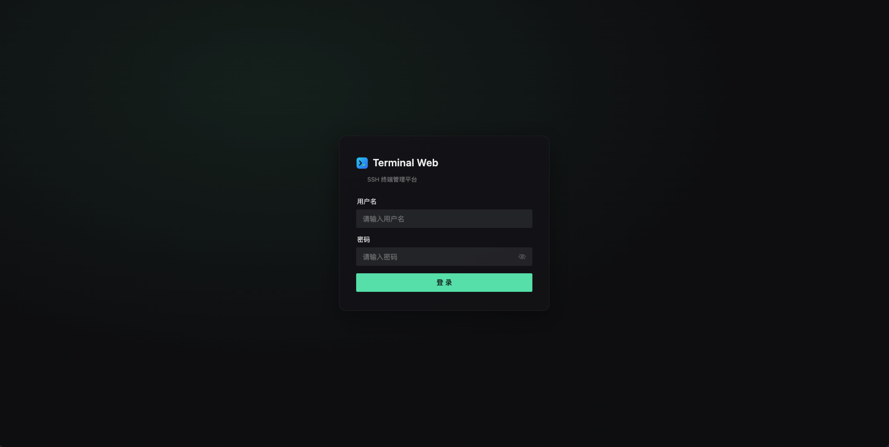
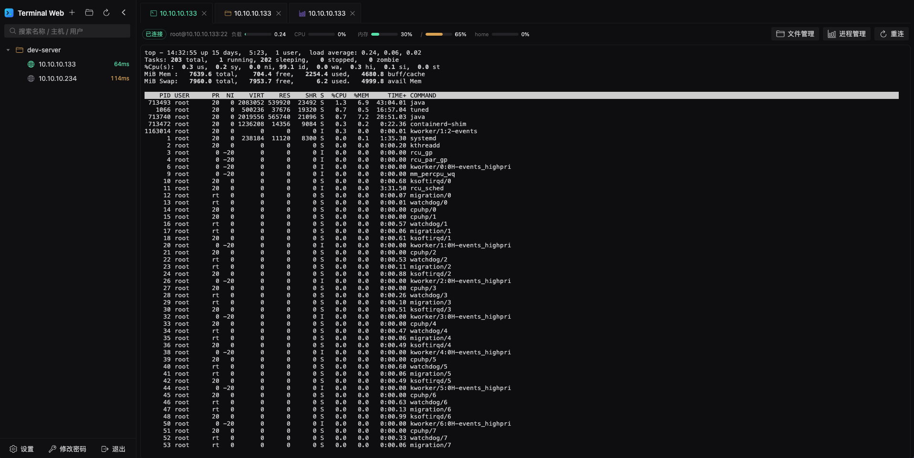
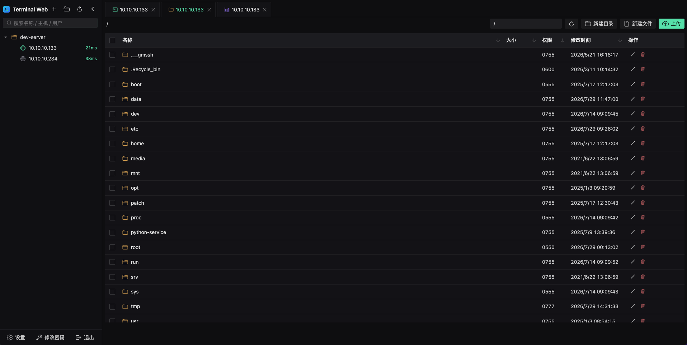
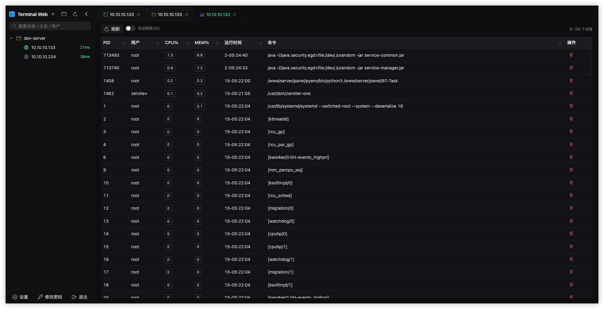

> 🇺🇸 English: [README.md](README.md)

# Terminal Web

> 一个**极简主义的 Web SSH 管理终端** —— 只做最常用的事，没有花里胡哨的东西。

## 项目简介

Terminal Web 的初衷很简单：做一个干净的、浏览器里就能用的 SSH 终端。

不少同类工具习惯把功能堆得满满当当，可日常用到的，无非是「连上机器、敲命令、传文件、看进程」。Terminal Web 就只围绕这几件事打磨 —— 界面克制、上手即用，不绑定复杂概念，也不强加多余配置。

它不追求大而全，只是把「该有的」做得顺手：连接分组管理、多标签终端、SFTP 文件传输、进程与系统状态监控，以及一键 Docker 自托管。

## 技术栈

- **前端**：Vue 3 + Vite + Naive UI + xterm.js + Monaco Editor
- **后端**：Node.js + Fastify + ssh2 + better-sqlite3
- **部署**：多阶段 Docker 镜像 / docker-compose

## 功能特性

- 🖥️ **Web SSH 终端**：基于 xterm.js 的多标签终端，支持跳板（堡垒机）级联连接（最多 5 级）。
- 📁 **文件夹分组**：连接可归入文件夹，左侧树形管理，支持搜索。
- 🔐 **多种登录方式**：账号密码、私钥证书（支持上传与粘贴），凭据 AES-256-GCM 加密存储。
- 📂 **SFTP 文件管理**：以主区域 Tab 方式打开，支持上传（带进度条）、下载、重命名、新建、在线编辑（≤2MB 文本）。
- 📊 **进程管理**：以主区域 Tab 方式打开，查看远程进程列表并支持结束进程。
- ⚡ **连接延迟探测**：左侧连接列表实时显示 SSH 往返延迟。
- 🎨 **主题与外观**：暗色 / 亮色主题、字体大小、字体族可配置。
- 🛡️ **安全增强**：登录验证码开关、登录失败锁定、IP 白名单、登录审计日志。
- 🐳 **Docker 部署**：多阶段构建镜像，数据卷持久化。

## 截图

**登录页**


**Web SSH 终端**


**SFTP 文件管理**


**进程管理**


## 快速开始（Docker）

### 1. 构建镜像

```bash
docker build -t terminal-web .
```

### 2. 运行容器

```bash
docker run -d \
  --name terminal-web \
  -p 3000:3000 \
  -v $(pwd)/data:/data \
  -e ADMIN_USERNAME=admin \
  -e ADMIN_PASSWORD=你的管理员密码 \
  terminal-web
```

启动后访问 http://localhost:3000 。首次访问若数据为空会进入**初始化设置页**，按提示创建管理员账号即可（也可通过 `ADMIN_PASSWORD` 环境变量在无人值守场景下自动建账号）。

### 3. 使用 docker-compose

```bash
docker compose up -d --build
```

`docker-compose.yml` 已挂载 `./data:/data` 作为数据卷，并包含 `TZ`、健康检查等配置。请务必修改其中的 `ADMIN_PASSWORD`。

## 环境变量

| 变量 | 必填 | 默认值 | 说明 |
|---|---|---|---|
| `ADMIN_USERNAME` | 否 | `admin` | 管理员用户名（仅在设置 `ADMIN_PASSWORD` 时自动建账号） |
| `ADMIN_PASSWORD` | 否* | — | 管理员密码；设置后首次启动自动创建账号（适合无人值守部署）。不设置则需通过页面初始化设置 |
| `ENCRYPTION_KEY` | 否 | 自动生成 | 凭据 AES 加密密钥（32 字节随机串）。**建议固定并持久化**，丢失或更改会导致已存凭据无法解密 |
| `JWT_SECRET` | 否 | 自动生成 | JWT 签发密钥。**建议固定并持久化**，更改会使所有登录会话失效 |
| `DATA_DIR` | 否 | `/data` | SQLite 数据库与密钥文件存放目录（容器内） |
| `PORT` | 否 | `3000` | 服务监听端口（容器内） |
| `STATIC_DIR` | 否 | `/app/public` | 前端静态资源目录（镜像构建时已写入 `web/dist`，一般无需改动） |
| `TZ` | 否 | `Asia/Shanghai` | 容器时区，影响审计日志时间 |

> *：生产环境务必设置 `ADMIN_PASSWORD`。不设置时需在页面完成首次初始化设置，初始化仅发生一次（数据卷保留 `users` 表，更新镜像不会重复建账号）。

## 本地开发

需要 Node.js 18+。

```bash
# 后端（终端 1）
cd server
DATA_DIR=./data PORT=3000 ADMIN_PASSWORD=admin123 npm start

# 前端（终端 2）
cd web
npm install
npm run dev
```

前端开发服务器默认监听 `http://localhost:5173`（注意是 `localhost`，非 `127.0.0.1`）。生产构建：

```bash
cd web && npm run build
cd ../server && STATIC_DIR=/绝对路径/web/dist PORT=3000 npm start
# 然后访问 http://localhost:3000
```

## 忘记密码 / 重置管理员密码

如果忘记了登录密码，无需重装或清空数据库，通过命令行即可重置（也适用于新建首个账号）。

**Docker（推荐，容器已挂载数据卷）：**

```bash
docker compose exec terminal-web node src/reset-password.js admin 你的新密码
# 或
docker exec -it terminal-web node src/reset-password.js admin 你的新密码
```

**本地开发：**

```bash
cd server
npm run reset -- admin 你的新密码
# 等价于 node src/reset-password.js admin 你的新密码
# 若数据不在默认 ./data，可前置 DATA_DIR=/path/to/data
```

说明：

- `<用户名>` 为任意已有账号；若该用户不存在，会自动以该用户名新建账号。
- 新密码至少 6 位（与页面注册 / 修改密码规则一致）。
- 重置后立即生效，用新密码即可登录；原会话令牌会失效，需重新登录。
- 登录页底部也提供了同样的操作提示。

## 数据持久化

所有数据位于 `DATA_DIR`（Docker 下为挂载的 `./data` 卷）：

- `terminal.db` —— SQLite 数据库（用户、文件夹、连接、设置、审计日志）
- `.enc-secret` —— 自动生成的凭据加密密钥（若未设置 `ENCRYPTION_KEY`）

**备份只需复制整个 `data` 目录。**

## 目录结构

```
.
├── Dockerfile            # 多阶段构建（前端 build + 后端运行）
├── docker-compose.yml    # 容器编排
├── server/               # 后端：Fastify + ssh2 + better-sqlite3
└── web/                  # 前端：Vue 3 + Vite + Naive UI + xterm.js
```

## 开源协议

本项目采用 [Apache License 2.0](LICENSE) 开源协议。
